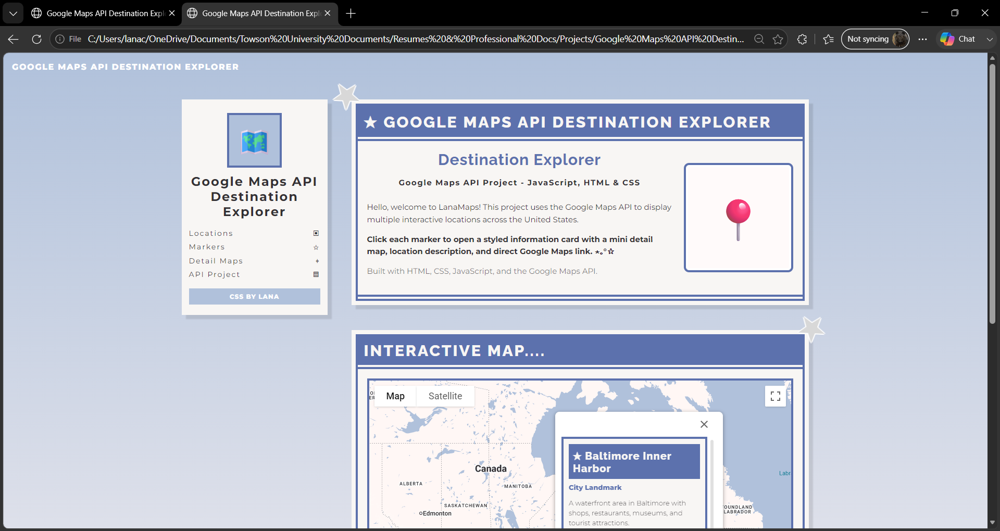

# Google Maps API Destination Explorer

This project is an interactive web mapping project built with HTML, CSS, JavaScript, and the Google Maps API. It displays custom location markers, styled information windows, mini detail map previews, and direct Google Maps links.

The design was customized with a soft blue portfolio-style layout inspired by profile/card-based web layouts.

## Features

- Interactive Google Map
- Multiple custom location markers
- Styled information windows
- Mini detail maps inside marker popups
- Direct links to open locations in Google Maps
- Custom CSS layout with blue/cream themed cards
- JavaScript location data structure for reusable marker creation

## Technologies Used

- HTML
- CSS
- JavaScript
- Google Maps API

## Project Structure

Google-Maps-API-Destination-Explorer/
- index.html
- style.css
- map.js
- README.md
- screenshots/

## Screenshots

### Destination Explorer Interface

### Map Info Window and Detail Map

## Setup Note

To run this project, replace `YOUR_API_KEY_HERE` in `index.html` with your own Google Maps JavaScript API key.

Do not upload an unrestricted API key to a public repository.

## Skills Demonstrated

- Google Maps API integration
- JavaScript
- HTML/CSS
- API-based web development
- Custom marker creation
- InfoWindow customization
- UI styling
- Front-end project documentation
